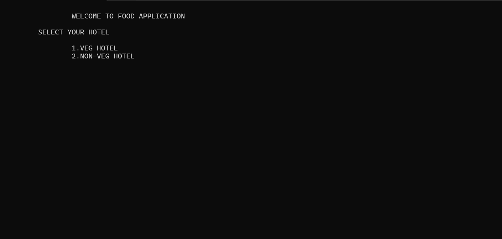

# 🍽️ Food Ordering Application

A simple and user-friendly food ordering application written in **C** that allows users to select from various vegetarian and non-vegetarian hotels, choose food items, specify quantities, and generate a total bill.

## 📋 Table of Contents

- [Features](#features)
- [Screenshots](#screenshots)
- [Requirements](#requirements)
- [Installation](#installation)
- [Usage](#usage)
- [Menu Overview](#menu-overview)
- [Project Structure](#project-structure)
- [Contributing](#contributing)
- [License](#license)

## ✨ Features

- **Dual Category System**: Choose between Vegetarian and Non-Vegetarian hotels
- **Multiple Hotel Options**: 5 vegetarian and 5 non-vegetarian restaurants
- **Diverse Menu**: Wide variety of dishes from different cuisines
- **Quantity Selection**: Choose the quantity for each food item
- **Real-time Billing**: Instant calculation of total amount
- **User-friendly Interface**: Simple console-based navigation
- **Error Handling**: Validates user inputs and provides appropriate feedback

## 📸 Screenshots



*Sample dashboard showing the application interface*

## 🔧 Requirements

- **Operating System**: Windows, macOS, or Linux
- **Compiler**: GCC (GNU Compiler Collection) or any C compiler
- **Terminal/Command Prompt**: For compilation and execution

## 🚀 Installation

### Windows

1. Install a C compiler (GCC):
   - Download and install [MinGW](http://www.mingw.org/) or [TDM-GCC](https://jmeubank.github.io/tdm-gcc/)
   - Add the compiler to your system PATH

2. Navigate to the project directory:
   ```cmd
   cd path/to/food-ordering-app-main
   ```

### macOS

1. Install GCC using Homebrew:
   ```bash
   brew install gcc
   ```

2. Navigate to the project directory:
   ```bash
   cd path/to/food-ordering-app-main
   ```

### Linux

1. Install GCC:
   ```bash
   # Ubuntu/Debian
   sudo apt update && sudo apt install gcc
   
   # CentOS/RHEL
   sudo yum install gcc
   ```

2. Navigate to the project directory:
   ```bash
   cd path/to/food-ordering-app-main
   ```

## 🏃‍♂️ Usage

### Compilation

Compile the application using GCC:

```bash
gcc food_app.c -o food_app
```

**For Windows users:**
```cmd
gcc food_app.c -o food_app.exe
```

### Running the Application

**Linux/macOS:**
```bash
./food_app
```

**Windows:**
```cmd
food_app.exe
```

### How to Use

1. **Select Hotel Type**: Choose between Vegetarian (1) or Non-Vegetarian (2) hotels
2. **Choose Hotel**: Select from 5 available hotels in your chosen category
3. **Select Food Items**: Browse the menu and select your desired dishes
4. **Specify Quantity**: Enter the quantity for each item
5. **Continue or Checkout**: Choose to add more items (0) or proceed to billing (1)
6. **View Total**: Your final bill amount will be displayed

## 🍴 Menu Overview

### Vegetarian Hotels

#### 1. Hotel Madhuras
- Idli (₹10), Dhosa (₹30), Pongal (₹50), Poori (₹20), Paneer Tikka (₹120)

#### 2. Vegetarian Hot
- Paneer Masala (₹80), Veg Fried Rice (₹120), Paneer Fried Rice (₹180), Veg Biriyani (₹150), Samosa (₹50)

#### 3. Veg Rice
- Veg Curry (₹60), Veg Khichdi (₹100), Veg Gobi (₹90), Veg Aloo (₹160), Veg Korma (₹90)

#### 4. Cafe Soul
- Cold Coffee (₹60), Cold Mocca (₹110), Kitkat Shake (₹140), Cold Chocolate (₹130), Hot Tea (₹65)

#### 5. Only Nature
- Paneer Momos (₹85), Veg Spring Roll (₹90), Veg Chilli (₹180), Veg Momos (₹150), French Fries (₹70)

### Non-Vegetarian Hotels

#### 1. Biriyani Center
- Non-Veg Meals (₹100), Chicken 65 (₹80), Chicken Biriyani (₹120), Mutton Biriyani (₹180), Mutton Choka (₹95)

#### 2. Karunas
- Sea Food (₹180), Fish Biriyani (₹160), Fish Thokku (₹120), Sea Meals (₹200), Chicken Fried Rice (₹140)

#### 3. Banana Leaf
- Chicken Noodles (₹180), Aloo Gobi (₹160), Masala Cola (₹120), Rosy Coffee (₹60), Black Sea (₹140)

#### 4. Acord
- Pizza (₹180), Egg Roll (₹90), Veg Roll (₹70), Ultimate Chicken (₹200), Chicken Tikka (₹140)

#### 5. Fast Food
- Sea Food (₹180), Sea Gravy (₹90), Fish Chokka (₹70), Fish Masala (₹200), Mutton Gravy (₹140)

## 📁 Project Structure

```
food-ordering-app-main/
├── food_app.c          # Main C source code
├── README.md           # This file
└── Dashoard.png        # Application screenshot
```

## 🎯 Sample Usage Flow

```
WELCOME TO FOOD APPLICATION

SELECT YOUR HOTEL
    1.VEG HOTEL 
    2.NON-VEG HOTEL

[User Input: 1]

THANK YOU FOR SELECTING VEG HOTEL
SELECT YOUR FAVORITE HOTEL
1.HOTEL MADHARAS 
2.VEGETARIAN HOT 
3.VEG RICE 
4.CAFE SOUL 
5.ONLY NATURE

[User Input: 1]

THANK YOU FOR SELECTING HOTEL MADHARAS
SELECT YOUR FOOD
1.IDLI 
2.DHOSA 
3.PONGAL 
4.POORI 
5.PANEER TIKKA

[User Input: 2]
ENTER THE QUANTITY:- [User Input: 2]

TOTAL AMOUNT :-60
Select 
0.Continue
1.Billing

[User Input: 1]

Total Amount: 60
```

## 🔨 Troubleshooting

### Common Issues

1. **Compilation Error**: Ensure GCC is properly installed and added to PATH
2. **Permission Denied**: On Linux/macOS, ensure the executable has proper permissions:
   ```bash
   chmod +x food_app
   ```
3. **Input Not Working**: Make sure to enter valid numerical choices as prompted

### Platform-Specific Notes

- **Windows**: Use `.exe` extension when running the compiled program
- **Linux/macOS**: Use `./` prefix when running the compiled program
- **All Platforms**: Ensure proper input format (numbers only when prompted)

## 🤝 Contributing

Contributions are welcome! Please feel free to submit pull requests or open issues for:
- Bug fixes
- Feature enhancements
- Code improvements
- Documentation updates

### Development Guidelines

1. Follow C coding standards
2. Add comments for complex logic
3. Test thoroughly before submitting
4. Update documentation as needed

## 📄 License

This project is open source and available under the [MIT License](LICENSE).

## 📞 Support

If you encounter any issues or have questions:

1. Check the troubleshooting section above
2. Review the source code comments
3. Open an issue in the project repository

---

**Happy Ordering! 🍕🥗🍜**

*Developed with ❤️ using C programming language*
